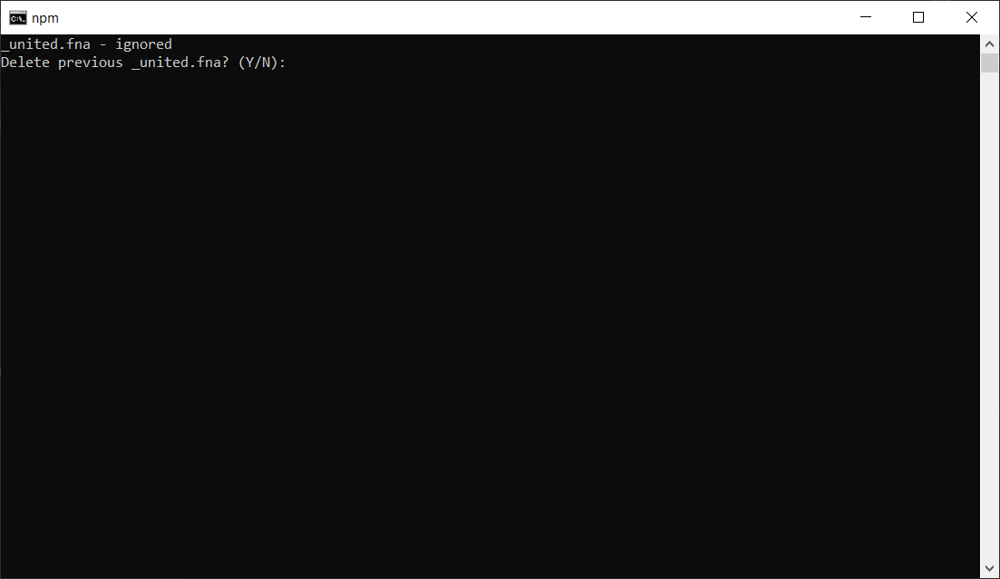

#File combiner
    
This app unites set of `.fna` files in one file.
You can download it [here](https://drive.google.com/drive/folders/1OsuaMNIKBW5p6Ofy-IT8dRrl-46IC01p?usp=sharing).

### Contents
   0. [X] [How to open](#how-to-open)
   1. [X] [How to work](#how-to-work)
   2. [ ] [For developers](#for-developers)
   3. [X] [Screenshots](#screenshots)

## How to open

   - open console in project folder and write `npm start` **or**
   - write in a console npm exe to create `.exe` file
   
## How to work

   1. You should choose the folder with `.fna` files
   
      - To navigate use `up and down arrows keys`
      - Press `Enter` to go into a folder
      - Press `Space` to choose a folder with `.fna` files
      
   3. All files which includes word `_united` will be ignored
   2. If there are `_united.fna` file in a folder - you should delete it with a program or manually
   3. Wait until finish combining and press any key to exit program
   
## For developers
    
   - [Documentation]()
 
## Screenshots 

   

        

            File-combiner screenshots
        

               
               
               
   

